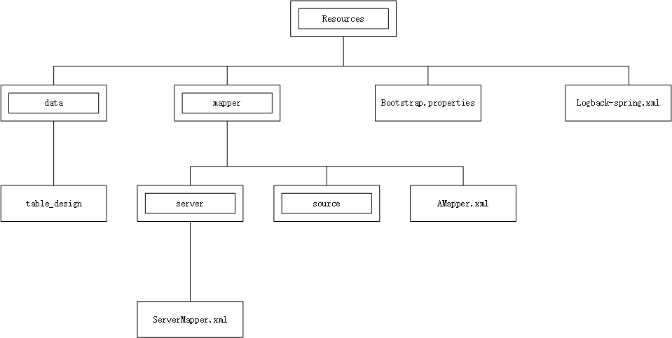
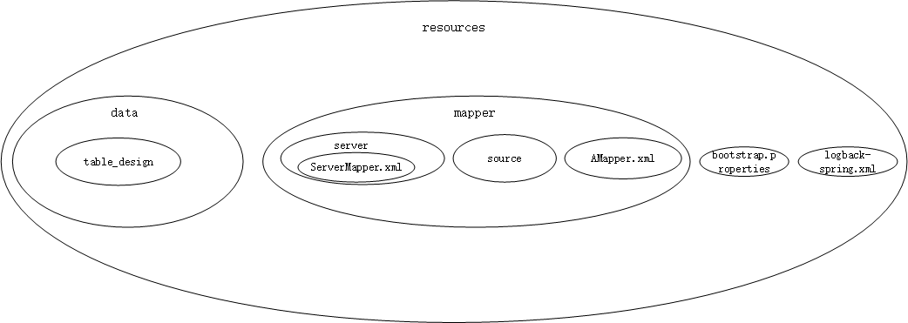
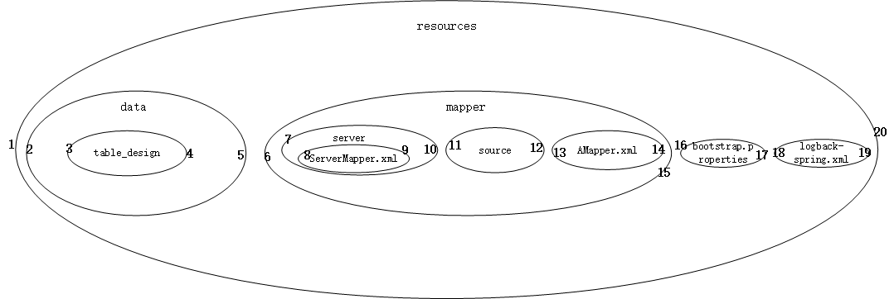

[English](https://bobotheknight.github.io/docs/sql_design/2023/01/29/implement-SQL-nested-sets-in-Java-en.html)


## 前言
最近有一个目录文件入库的需求，条件是：
1. 入参是解压后的文件夹路径； 
2. 解压后的文件不存在变更及更新的情况。

需求详情是：
1. 文件夹及其所有子目录和子文件，都需要解析成树结构响应给前端；
2. 需要在点击每一级目录时，都拿到这个目录下所有文件（包括子目录下的文件）进行一些业务数据的统计；
3. 只能使用关系型数据库MySQL。

经过[调研](https://stackoverflow.com/questions/4048151/what-are-the-options-for-storing-hierarchical-data-in-a-relational-database)，
发现[嵌套集设计](http://mikehillyer.com/articles/managing-hierarchical-data-in-mysql/)
[(译文1)](http://www.snowpeak.org/cn/article/detail/further_discussion_on_managing_hierarchical_data_with_nested_set_model/)
[(译文2)](https://developer.aliyun.com/article/50149#slide-0)
很适合这样的场景。
（如果项目中用到了图数据库，图数据库是处理复杂层次数据更好的选择。）

互联网上很难找到使用Java实现的现成代码，只在github上找到一个[项目](https://github.com/eXsio/nestedj)实现了一部分功能。但此项目不支持MyBatis，我不计划采用，因此只能自己实现嵌套集设计。

这篇文章会简单介绍嵌套集模型 Nested Set Model，详细介绍如何使用Java，从建表到入库实现嵌套集模型。

本文示例使用 `MySQL 8.0`、`JDK 8`

---
## 嵌套集模型
在面对分层结构数据存储时，例如目录，

我们往往采用被称为**邻接表模型**的方案，表字段设计大约是：
```
id, name, parentId
```
在邻接表中，所有的数据均拥有一个parentId字段，用来存储它的父节点ID。当前节点为根节点的话，它的父节点则为NULL或者-1。在遍历时，可以使用递归实现查询整棵树，也可以方便地查询到下一级节点。增删也方便。但是当数据量较大时，查询整棵树会影响性能，甚至导致内存溢出。
因此在使用中，我们通常会使用懒加载的方式，一级一级展示数据。或者限制递归的深度，只展示一部分数据。

如果已知数据增删改很少，对查询性能要求比较高、并且像我们的需求一样，需要查某节点下所有叶子节点，就可以考虑使用嵌套集模型了。嵌套集模型的设计大约是：
```
id, name, left_index, right_index, depth
```
也就是把各个节点看做一个个容器，子节点在父节点内部，所有节点都在根节点中；用图片表示如下：


再自左向右编号，每个容器都有左右两个编号，即为left与right; 用图片表示如下：


为了方便查询下一级节点和其他节点，可以增加一个depth字段，用来表示深度。
至此，可以得到每个节点的左右值。
下文仅列举几个最常用的SQL，其他SQL可在[嵌套集设计](http://mikehillyer.com/articles/managing-hierarchical-data-in-mysql/)中查看.

---
## 使用Java实现

### MySQL表设计
```mysql
CREATE TABLE `file_nested_sets_demo` (
  `id` varchar(100) NOT NULL COMMENT '文件ID，唯一标识',
  `path` varchar(2000) CHARACTER SET utf8mb4 COLLATE utf8mb4_0900_ai_ci DEFAULT NULL COMMENT '文件完整路径',
  `type` varchar(100) DEFAULT NULL COMMENT '文件类型; Directory,File',
  `size` double DEFAULT NULL COMMENT '文件大小',
  `tree_id` bigint DEFAULT NULL COMMENT '每棵树的ID',
  `left_index` bigint NOT NULL COMMENT '左值',
  `right_index` bigint NOT NULL COMMENT '右值',
  `depth` bigint NOT NULL COMMENT '深度',
  PRIMARY KEY (`id`),
  KEY `idx_tree_id_indexes` (`tree_id`,`left_index`,`right_index`)
) ENGINE=InnoDB DEFAULT CHARSET=utf8mb4 COLLATE=utf8mb4_0900_ai_ci COMMENT='文件嵌套集表示例';
```
### 构建映射实体
```java
/**
 *  入库使用的嵌套集对象  
 */
public class FileNestedSetsDemo {

    /**
     * 文件ID，唯一标识
     */
    private String id;

    /**
     * 文件完整路径
     */
    private String path;

    /**
     * 文件类型； FILE/DIRECTORY
     */
    private String type;

    /**
     * 文件大小
     */
    private Double size;

    /**
     * 树ID
     */
    private Long treeId;

    /**
     * 左值
     */
    private Long leftIndex;

    /**
     * 右值
     */
    private Long rightIndex;

    /**
     * 深度
     */
    private Long depth;
}
```

### 数据编号入库
已知输入的数据为文件路径，路径结构同上图，如：
```text
|== 表示文件夹； |-- 表示文件。
 |==resources
            |==data
                  |--table_design
            |==mapper
                  |==server
                        |--ServerMapper.xml
                  |==source
                  |--AMapper.xml
            |--bootstrap.properties
            |--logback-spring.xml
```

需要的输出的数据是：
```text
depth   left_index|||path|||right_index
0   1|||\resources|||20
1   2|||\resources\data||5
2   3|||\resources\data\table_design|||4
1   6|||\resources\mapper|||15
2   7|||\resources\mapper\server|||10
3   8|||\resources\mapper\server\ServerMapper.xml|||9
2   11|||\resources\mapper\source|||12
2   13|||\resources\mapper\AMapper.xml|||14
1   16|||\resources\bootstrap.properties|||17
1   18|||\resources\logback-spring.xml|||19
```

我们可采用`先序遍历算法`构造数据，从左到右、一次一层，遍历其子节点并赋值。  
以下代码使用深度优先的方式，对目录进行遍历赋值，返回Map。  
该算法可能不够完备，如果有哪里可以优化，请联系我。
```java
public class NestedSetsUtil {
    /**
     * 使用深度优先遍历目录，返回Map，用来支持嵌套集初次入库。
     *
     * @param root 需要遍历的目录
     * @return Map<file对象，Object对象>
     **/
    public static Map<File, NestedSetObj> dfs2NestedSets(File root) {
        if (root == null) {
            return new HashMap<>(0);
        }

        //记录深度 每次出栈-1, 每次入栈+1
        long depth = 0L;
        //左右值
        long index = 1L;
        Deque<File> stack = new ArrayDeque<>();
        stack.push(root);

        //全局的对象集合，同时也表示了这个对象是否入栈过。
        Map<File, NestedSetObj> map = new LinkedHashMap<>();
        //根目录，直接给值
        NestedSetObj rootObj = NestedSetObj.builder().path(root.getAbsolutePath()).depth(depth).left(index++).build();
        map.put(root, rootObj);

        while (!stack.isEmpty()) {
            File cur = stack.pop();
            depth--;
            File[] files = cur.listFiles();
            if (files != null) {
                //找到下一个节点就执行
                for (File next : files) {
                    //下一个节点如果没有被访问过就执行
                    if (!map.containsKey(next)) {
                        //当前节点和下一个节点入栈
                        depth++;
                        stack.push(cur);
                        depth++;
                        stack.push(next);
                        //每首次访问，节点赋值left
                        NestedSetObj obj = NestedSetObj.builder().left(index++).path(next.getAbsolutePath()).depth(depth).build();
                        boolean leaf = !next.isDirectory();
                        boolean emptyDirLeaf = next.listFiles() != null && next.listFiles().length == 0;
                        //叶子节点或空目录直接赋right值
                        if (leaf || emptyDirLeaf) {
                            obj.setRight(index++);
                        }
                        map.put(next, obj);
                        break;
                    }
                }

                //判断是否需要给叶子节点的right赋值；我们认为，只有当前目录下，所有子一级的数据都有了right值，则当前目录可以被赋值。
                long min = Long.MAX_VALUE;

                for (File file : files) {
                    NestedSetObj childObject = map.get(file);
                    if (childObject == null) {
                        min = 0L;
                        break;
                    }
                    min = Math.min(min, childObject.getRight());
                }

                //给非叶子节点的right赋值;当一级子节点都有了right值，index 加一即为当前节点的right值。
                if (min > 0L && Long.MAX_VALUE != min) {
                    NestedSetObj curObj = map.get(cur);
                    if (curObj.right == 0L) {
                        curObj.setRight(index++);
                    }
                }
            }
        }
        //根目录的右值=节点数量*2
        rootObj.setRight(map.size() * 2L);
        return map;
    }

    /**
     *  文件嵌套集对象，业务无关  
     */
   public static class NestedSetObj {
        private long left;
        private long right;
        private long depth;
        private String path;
    }

}
```
接着把 `NestedSetsUtil#dfs2NestedSets()` 响应的数据遍历，赋值给`FileNestedSetsDemo`，批量入库即可。

### 根据业务需求，查询数据
* 检索单个路径下的所有类型为文件的子节点
```sql
SELECT node.*
FROM file_nested_sets_demo AS node,
     file_nested_sets_demo AS parent
WHERE  node.depth = parent.depth + 1
    AND node.left_index  > parent.left_index
    AND node.right_index < parent.right_index
    AND node.tree_id = 1  
    AND parent.path = '\resources\mapper'
    AND node.type = 'FILE'
ORDER BY parent.left_index
```

* 检索单个树下的所有子节点
```sql
SELECT node.*
FROM file_nested_sets_demo AS node
WHERE node.tree_id = 1
ORDER BY node.left_index
```

### 扩展查询语句

* 检索单个路径下的直接子节点

```sql
SELECT node.*
FROM file_nested_sets_demo AS node,
     file_nested_sets_demo AS parent
WHERE node.depth = parent.depth + 1
    AND node.left_index  > parent.left_index
    AND node.right_index < parent.right_index
    AND node.tree_id = 1  
    AND parent.path = '\resources\mapper'
ORDER BY parent.left_index
```

---
# Note
可以执行的Java算法见 [github](https://github.com/BoboTheKnight/NestedSetDemo)